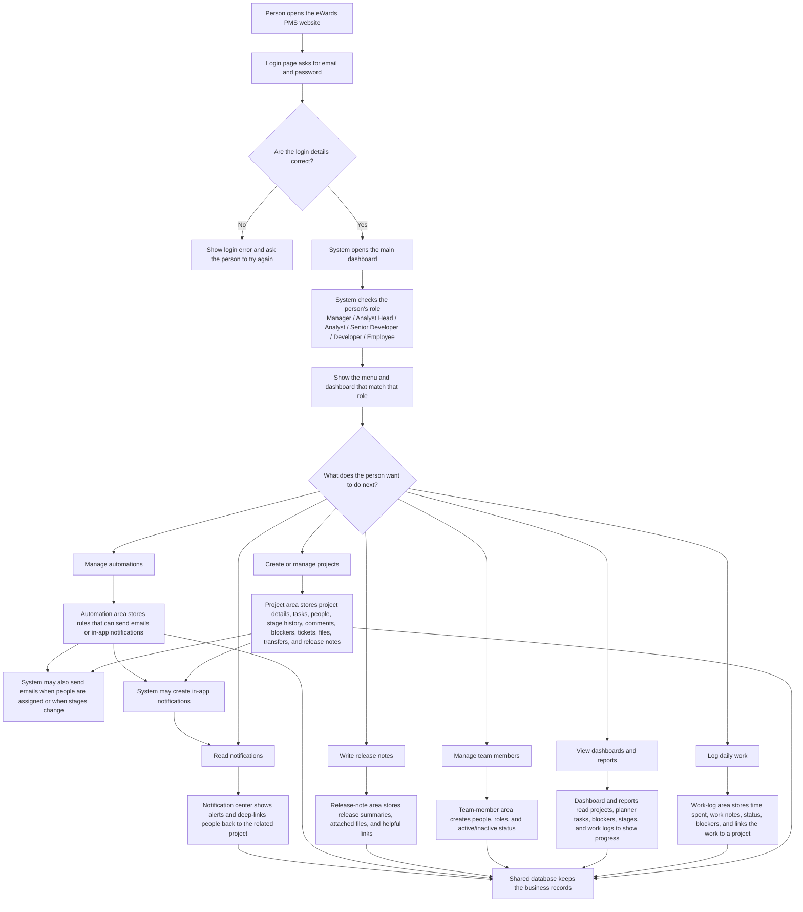
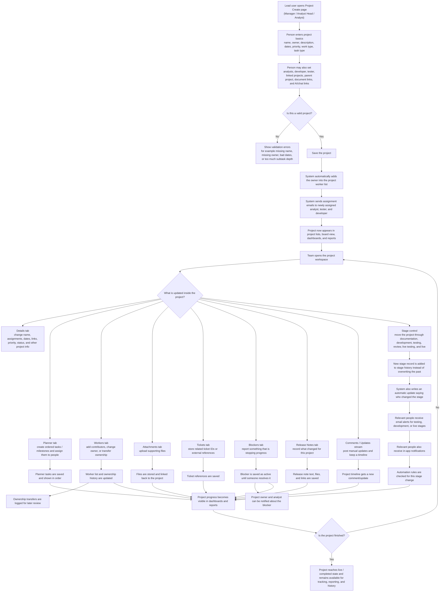
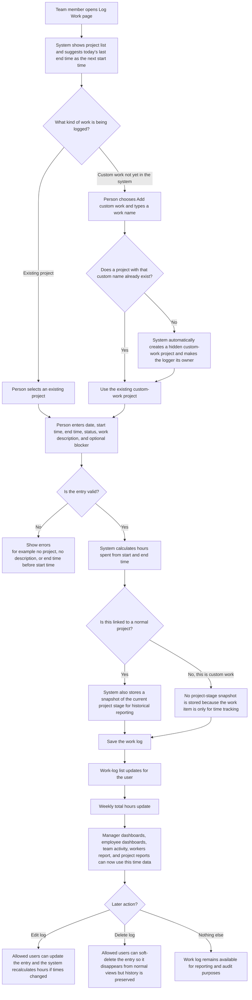
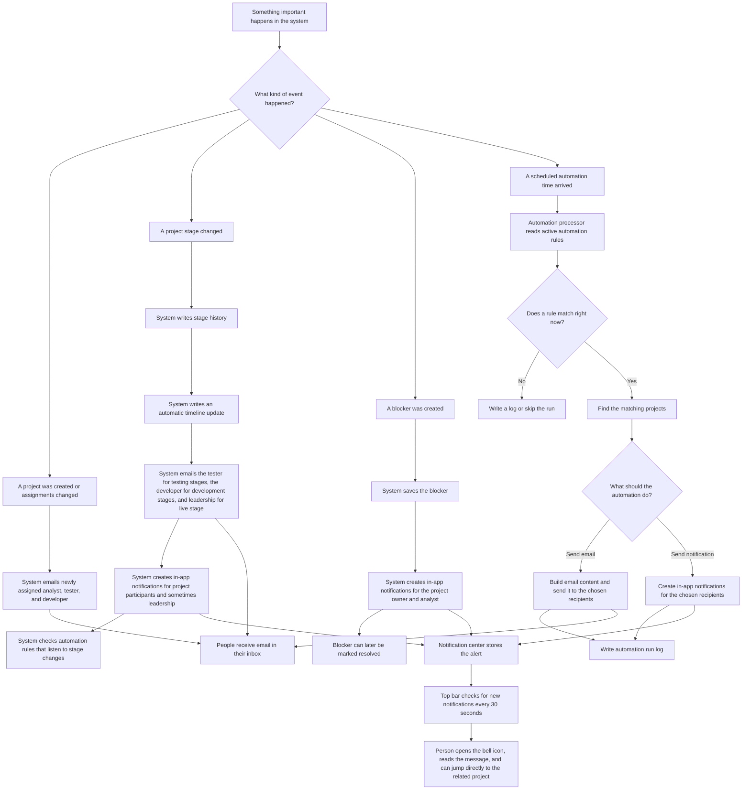
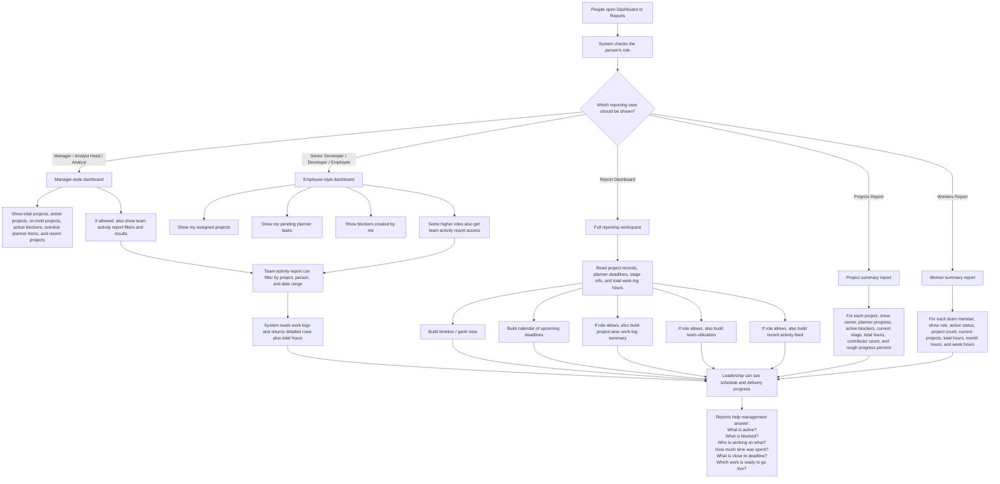
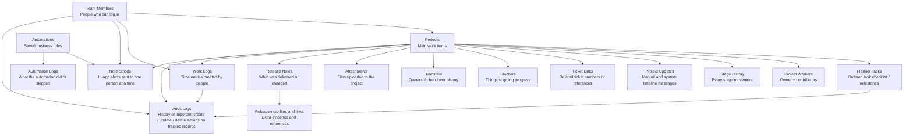

# eWards PMS Non-Technical Flowcharts

These flowcharts are based on the current Laravel + Vue/Inertia codebase in this repository.

The system is too broad to explain clearly in one readable picture, so this document gives:

1. A master business flow of the whole product
2. A detailed project lifecycle flow
3. A detailed work-log flow
4. A detailed alerts / notifications / automation flow
5. A detailed reporting flow
6. A simple record map showing what the system stores

## 1. Master Business Flow

## 2. Detailed Project Lifecycle Flow

## 3. Detailed Work-Log Flow

## 4. Detailed Alerts, Notifications, and Automation Flow

## 5. Detailed Reporting and Dashboard Flow

## 6. Core Record Map

## Practical Reading Order

If a non-technical stakeholder wants to understand the product quickly, read the diagrams in this order:

1. Master Business Flow
2. Detailed Project Lifecycle Flow
3. Detailed Work-Log Flow
4. Detailed Alerts, Notifications, and Automation Flow
5. Detailed Reporting and Dashboard Flow
6. Core Record Map
